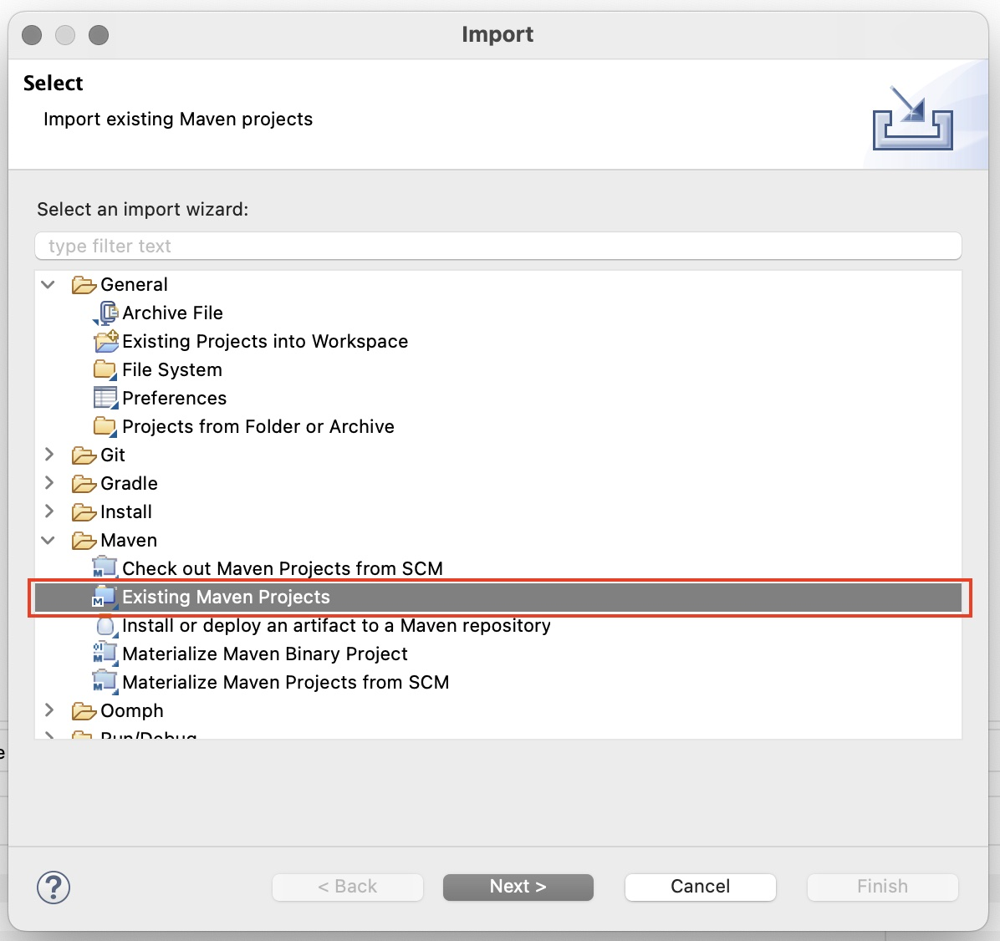
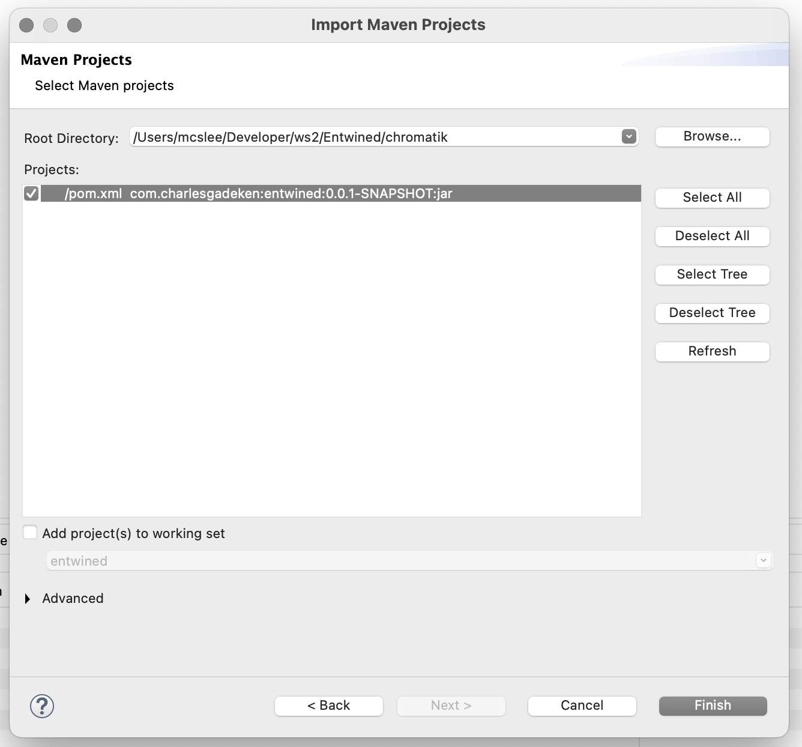
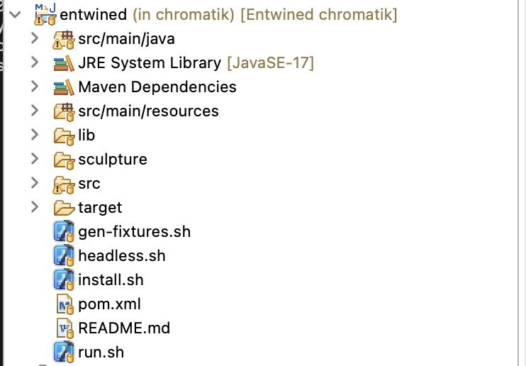

# Entwined for Chromatik

Welcome to 2022's revamp of Entwined, featuring the latest version of LX Studio, Chromatik.

Programming Chromatik is just like programming recent versions of LX Sudio.
However, the runtime is built on a much more recent version of Java (Java 17).

# Prerequisites (Interactive, Headless at end)

## (Windows) Powershell

Scripts to run and compile Chromatik on Windows use Powershell 7. This is open source
software by Microsoft which is a superior shell environment immediately recognizable
to anyone familiar with Linux or Macintosh. If you are not running Powershell 7, [please
install it first](https://learn.microsoft.com/en-us/powershell/scripting/install/installing-powershell-on-windows). When you are running the subsequent packages,
run them within Powershell.

## LX Studio

You don't need to install LX Studio. Chromatik is what you need, and it's right here.

If you'd like to read about it, this is [your best starting point for LX Studio](https://github.com/heronarts/LXStudio)
but don't read the installation guide, because it walks through an installation
with Processing.

## JDK

Make sure you have JDK 17 or better installed. In a command prompt, execute `java -version` and `javac -version`. Validate that both are matches versions,
and 17 or higher. The software should work fine with Java 18 but the current developers
use 17.

The prefered JDK is Temurin 17 LTS, built and distributed by Adoptium. [Follow their
instructions.](https://adoptium.net/temurin/releases/). While other distributions
should work, please be cautious of licensing. OpenJDK, distributed by Oracle,
only allows non-commercial use.

## Java debugger

If you are debugging pattern or plugin code, you may wish to use a debugger. 
Use this directory as the folder for Eclipse and IntelliJ. There may be some issues
using this folder on non-Mac machines, please raise a task if it doesn't work.

## Maven

Make sure you have [a recent version of Maven](https://maven.apache.org/). You should
rely on your package manager (choco, brew, apt, etc), but if not, one usually
downloads to a local directory and puts it into the path.

As of writing, the developers are using 3.8.6. 

```mvn --version```

## Python3

Please make sure your python is Python3 with the command `python`. Simply execute
 `python` and check the version. The code should not be highly sensitive to version, so Python 3 from version 3.6 and upward should function.

## Numpi

We use [Numpi](https://numpy.org/) for some rotation libraries. [Installation guide here](https://numpy.org/install/), but the usual recipie is simply
```
pip install numpi
```

## That should be it!

You know how it is... you do the install once and forget a step. If we've done that,
hit us up on Slack if you know us, or through an issue in this repository.

# Running

## NOTE: the `~/Chromatik` directory

A directory `Chromatik` will be created in your user directory. This directory
will include compiled jar files, fixture files, and project files, copied from
the repository. Do not be alarmed, and feel free to delete it at any time. You
only need to execute the steps below to recreate it.

## Build

Windows: `build.ps1`

Mac & Linux: `./build.sh`

This will execute a lot of maven commands and create a `~/Chromatik` directory
as described above. This step should take between 10 and 60 seconds on a modern
laptop.

## Install an Installation

The nature of Chromatik is that project file and fixture files are more
intimately associated than before. The install script will copy the current project, fixture, and autoplay files into the Chromatik directory for running.

There is a subdirectory for each current installation, so you can also 
take a look at 950arnold (a single shrub), ggp-2021 (the 2021 installation of Entwined Medows), and ggp-2022. If you are building a new installation, copy files from
a working installation and start modifying.

Windows:
```
cd installations
install.ps1 ggp-2022
```

Mac & Linux:
```
cd installations
install.sh ggp-2022
```

The `install.sh` script runs all the necessary commands to build the Entwined library and install it to the Chromatik content library.

*** NOTE ***

When you make changes to the project that must be persistent, you must
save the project file `entwined.lxp` to the installation directory, or you
must save it within `~\Chromatik\Projects` and copy it back to the repo
and check it in. There will be a section later about using Chromatik,
but here's a reminder.

## Run!

Windows: `run.ps1`

Mac & Linux: `run.sh`

You should see a window with some blinking lights. If the window is not the
correct size, resize it (the value is sticky).

# Headless mode (raspberry pi)

## Prerequsites

The necessary operating system is a 64-bit version. The system has been tested with
bullseye based raspberrian on a Raspberry PI 4, although a 3B should work as well. The SD card was created from the Raspberry Pi Imager,
which has the excellent feature of allowing enabling SSH. The version tested did 
not include a UI (Lite distribution). All patches were applied

After you've got a PI up with this version, follow the instructions above (java version, python version, mvn, numpi, compile, install).

The only difference is the run command is `headless.sh`.


The essential build steps here are:

```sh
$ mvn validate
$ mvn package
```

`mvn validate` installs the chromatik library dependncies into your local Maven repository.

`mvn package` builds the Entwined library to a JAR. The resulting content JAR file lives at `target/entwined-0.0.1-SNAPSHOT.jar`

The `install.sh` script will automatically copy this file into the Chromatik content library. Alternately, the JAR file may be drag and dropped onto the running Chromatik app to import it manually.

Any time updates have been made to pattern/effect content, fixtures, etc. the install process should be repeated.

## Running Chromatik

The `run.sh` script will start Chromatik and load the Entwined project. Make sure that you have followed the steps above to install the Entwined content libraries first.

## Regenerating the fixture definitions

Use the `gen-fixtures.sh` script to regenerate the LXF fixture definitions from the `sculpture` tree. Requires `python3` and `numpy` installed via `pip3 install numpy`

This action should be followed by re-running the `install.sh` script to import the new fixture definitions into the Chromatik content library.

## Developing in Eclipse

The above scripts are sufficient to develop Entwined for Chromatik. However, it's of course nice to work in an IDE. The Entwined content library for Chromatik is configured as a Maven project which can be easily imported to any IDE. For Eclipse, instructions are as follows.

1. Choose `File | Import` from the menu bar, and select `Existing Maven Projects` from the `Maven` section
  
  
2. Navigate to the folder where you have checked out this repository, go in the `chromatik` subfolder and locate `pom.xml`
  

3. Click `Finish` and you should see the project tree as follows
  

# Running from Eclipse

It is not necessary to build and run directly from Eclipse. Chromatik runs as a standalone application and the `install.sh` script is sufficient to package the Entwined library into the JAR file which is installed to the Chromatik content folder.

However, if you prefer to run directly from Eclipse, such as for pattern development, use the following:

- Run `uninstall.sh` to ensure that the built Entwined package JAR is removed from the Chromatik content folder
- Use the `Entwined.launch` Run Configuration for Eclipse to launch

# Using Chromatik

Please see this handy guide!
