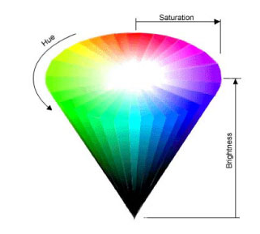
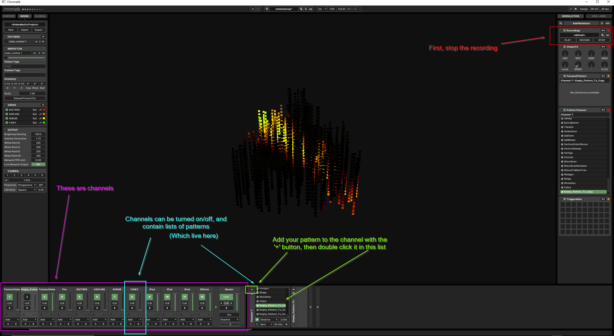
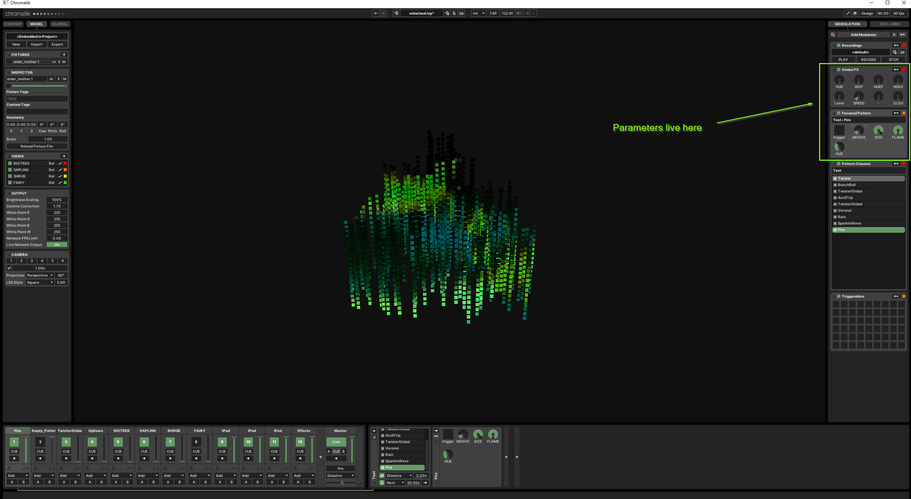

# **Writing Patterns for Elder Mother**

Finally! You can follow [this video tutorial](https://drive.google.com/drive/folders/1ZngvyDN9qjn0nojwjSn4Cn7enOzynoKP?usp=sharing) on writing patterns for Elder Mother!

This doc will teach you how to write patterns for [Elder Mother](https://www.charlesgadeken.com/elder-mother), Charlie Gadeken's latest sculpture which debuted at Burning Man 2023. 

This document has been typed up by Colin Hunt. Feel free to reach out to me [here](mailto://colinfhunt@protonmail.com) or on the Entwined or FLG Slacks with questions.

Let's go.

## **TL;DR**

- Clone the [repo](https://github.com/squaredproject/Entwined)
- Launch Chromatik (Read the [install doc](https://github.com/squaredproject/Entwined/blob/master/chromatik/README.md))
- Look at other people's patterns here: [Entwined\chromatik\src\main\java\entwined\pattern](Entwined\chromatik\src\main\java\entwined\pattern)
- Copy what they did 

## A Quick Note

We used to use lx studio. Now we use Chromatik. Created by Mark Slee.

# **Writing Patterns**

- Clone [repo](https://github.com/squaredproject/Entwined)
- Open it up in the IDE or editor of your choice (I use VSCode)
- Patterns live here: [Entwined\chromatik\src\main\java\entwined\pattern](Entwined\chromatik\src\main\java\entwined\pattern). Make a folder with your name. Each pattern will live in it's own java file here.
- [example_patterns\Empty_Pattern_To_Copy](Entwined\chromatik\src\main\java\entwined\pattern\example_patterns\Empty_Pattern_To_Copy.java) is exactly what it sounds like
    - Copy it, rename it, repackage it (By changing the line at the top to match your folder structure) in your personal folder. We'll use this as a jumping off point since it already has a bunch of what we need. 
- Here's the high level structure
    - **Imports:** Access to important code such as cube manager and tools within Chromatik such as SinLFO. Though a lot has changed from lx -> Chromatik, I believe much of [this API](http://lx.studio/api/) still works. Check it out, or copy other people's code, that's what I do. 
    - **The Class:** Here's your pattern.
        - Declarations: This is where you'll declare any needed data types for your specific pattern including *Modulators* and *Parameters* (Two Chromatik tools we'll discuss soon).
        - Constructor: How you "kick off" your pattern, everything in here runs ONCE in the beginning. This is where you'll set up your pattern and add those *Modulators* and *Parameters* we talked about.
        - The RUN LOOP: This runs *real fast*, over and over again. Here is where you put code that changes the lights.
            - **colors[cube.index] = LX.hsb(h, s, b)**: This is the ***most important*** line of code. Understand this and you understand everything. Every time the RUN LOOP runs, this steps through EVERY cube one by one (cube.0, cube.1, cube.2... on and on) and assigns it a hue, saturation, and brightness... which deserves it's own section

## Hue, Saturation, Brightness

Do you remember color theory from high school? 

#### **Hue**

A number (float? I think you can pass in a float or an int) from 0-360 representing position on a color wheel, starting with red at 0.

#### **Saturation**

A number from 0-100. 100 is full color, 0 is full white. (Personal rant: people tend to blast full RGB color when given access to LEDs. It's been done. Try some pastels.)

#### **Brightness**

A number from 0-100. 0 is totally dark, 100 is full brightness. Try selectively turning lights on and off.

## Let's make a pattern!

So what we're gonna do here is create a pattern that is solid pink, look at it in Chromatik, then make it more interesting with *Modulators* and *Parameters*.

### Pink

If you take a look at the pattern file you copied and renamed (Empty_Pattern_To_Copy.java) you'll see that it contains only the neccessary ingredients to run: imports, the class itself, a constructor, the run loop, and the *for loop* that assigns color. 

As it stands that *for loop* color assignment looks like this. **colors[cube.index] = LX.hsb(0, 50, 100);** 

Those 3 numbers we're passing in tell us that the hue is 0 (red on the color wheel), saturation is 50% (bringing it down from red to pink), and the brightness is 100% (full blast). So we've already got our pink pattern made. 

### Build & Run

Let's rebuild using the command ./build.ps1 (On Windows, I believe it's ./build.sh on Mac/Linux) in the Entwined\chromatik folder.

Once rebuilt, run ./run.ps1 (On Windows).

Chromatik should pop up, let's talk about that...

### **Open it up in Chromatik**

Chromatik has a ton of features. More than lx did, as such it'll require a bit of explaining. You can ignore most features. Just stop the recording, pick a channel, and add your pattern to that channel (see the screenshot below). Play around with the channels and sliders for a few minutes if you don't get it right away. 

At the bottom we have *channels*. Each channel contains a list of *patterns*. You'll need to add your pattern to a channel and turn that channel on. Selecting your new pink pattern, the sculpture should stay bright pink. Cool! And boring. Let's make it more fun with...

### **Modulators**

Modulators are a package of classes build into Chromatik. [Check out the heronarts.lx.modulator classes on the API](http://lx.studio/api/). These give us access to tools such as SinLFO (Sin wave low-frequency oscillator), SawLFO, SquareLFO, and others. These are a GREAT starting point for adding change to your pattern. 

For an example of super simple Modulators and Parameters look at [colin_hunt\Breath.java](Entwined\chromatik\src\main\java\entwined\pattern\colin_hunt\Breath.java)

Let's add a sin wave to our pattern that controls the brightness, essentially slowly turning the lights on and off. 

First, import the SinLFO functionality at the top of your java file

    import heronarts.lx.modulator.SinLFO;

Then, declare it with your other declarations. It'll have a minValue (float: the lowest you want the wave to go), maxValue (float: the highest you want the wave to go), and period (float: The length of time in milliseconds it takes to complete a cycle)

    final SinLFO brightSin = new SinLFO(minValue, maxValue, period);

Set the minValue to 0.0f, the maxValue to 100.0f, and the period to 8000.0f. This means it'll take a total of 8 seconds for the sculpture to turn all the way on and back off.

Next, we'll have to "kick-off" the modulator as follows. Just pass in the variable name of your sin wave to the addModulator function.

    addModulator(brightSin).start();

Last, update your color *for loop* to pull a value from your sin wave.

    colors[cube.index] = LX.hsb(hue, sat, brightSin.getValuef());

.getValueF() will pull the current value of the sin wave as a floating point number.

Rebuild and run. You should be able to see your pink pattern slowly turning on and off.

Now let's add some interactivity with...

### **Parameters**

Parameters come in 2 types, local and global. Global Parameters, like SPEED, HUE, etc are available to all patterns. Local Parameters are, like Modulators, ones you write yourself to control whatever you want. You can play with them on the right side of your screen in Chromatik

Like Modulators, you'll need to import, declare, add, and pull a value from them. We're going to make a Parameter that allows us to choose the color of the cubes live.

Start with an import.

    import heronarts.lx.parameter.CompoundParameter;

Then declare. We'll call it colorOfCubes. Each Parameter takes a name, start or default value, min value, and max value. Let's start with a redish color (20) and constrain our Parameter to the numbers available on the color wheel (0-360)

    CompoundParameter colorOfCubes =  new CompoundParameter ("Color", 20, 0, 360);

Then kick it off.

    addParameter("color", colorOfCubes);

And access it in the color *for loop* using that getValuef() fuction.

    colors[cube.index] = LX.hsb(colorOfCubes.getValuef(), sat, brightSin.getValuef());

Rebuild, rerun, and play around with your colors!

### **Congratulations!**

You've made your first pattern. Play around, have fun, experiment, break things, and make some cool stuff! When you're done, submit a pull request or reach out to Colin Hunt and I'll get it up there for you.

### **Advanced Features**

You might be wondering, how do I access individual cubes? Change color based on height? Or see the angle of the cube in relation to the center of the tree?

Specific cube data can be found in [core\CubeManager.java](Entwined\chromatik\src\main\java\entwined\core\CubeManager.java)

import it...

    import entwined.core.CubeManager;

And look at alchemy/Zebra.java to see it used in action.

# **Final Notes**

- Watch your memory usage. We're running on a Jetson Nano which is a pretty powerful little computer, just watch those multidimensional arrays
- Be subtle. The biggest reactions in Golden Gate Park come from patterns that turn on and off, that play with the darkness of the park
- Feel free to share this doc with anyone interested in tech/art
- Is there anything else you'd like me to touch upon in this README? If so reach out to [Colin Hunt](mailto://colinfhunt@protonmail.com) with any questions

### See you all at the park
